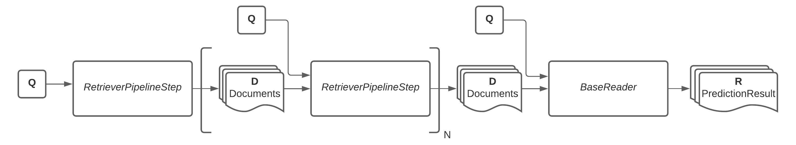

# Converse
Converse is a Information Retrieval framework for researching Conversational Search. It was built from
[Haystack](https://github.com/deepset-ai/haystack) version Sep 2020  (not around). Haystack is a framework for
modelling Question-Answering system. If that is what you are looking for, please pay them a visit as well!

## Contents
1. [Architecture](#architecture)
2. [Get started.](#getstarted)
3. [How to use.](#howtouse)
4. [Acknowledgement.](#acknowledgement)

<a name="architecture"></a>
## Architecture

ConverSE supports pipelines with the following architecture:



A pipeline is built from N instances of `RetrieverPipelineStep` which return a list of `Document` instances. Its
`retrieve` function takes questions and optionally the results of the previous `RetrieverPipelineStep`. At the end
of the pipeline, there is a rader which returns a list instances of `PredictionResult`. 

<a name="getstarted"></a>
## Get started

Converse was built with Python 3.7. 

To get started, all you need to do is install this package and its dependencies via pip:
```
pip3 install git+https://github.com/giguru/converse
pip3 install -r requirements.txt 
```

The repository comes with a development data set. If you want to have a test data set, please run the following command
as well:
```
bash download_data.sh
```

<a name="howtouse"></a>
## How to use


### Document stores
Firstly, choose a document store which functions as a database and indexer.
```python
document_store = FAISSDocumentStore(vector_dim=128)
```

Converse comes with several document stores. Which type is optimal depends on your use case.

- FAISSDocumentStore: optimal for embedding retrieval.
- SQLDocumentStore: optimal for sparse retrieval.
- ElasticsearchDocumentStore: works well for both embedding and sparse retrieval.

### Add data to documents stores
Secondly, data needs to be added to the document store.
```python
label, documents = orconvqa_read_files(...)
document_store.write_documents(documents)
document_store.write_labels(labels)
```

### Define your components
Then define your retriever and reader.
```python
retriever = ORConvQARetriever(
    document_store=document_store,
    use_gpu=True,
    embed_title=True,
    max_seq_len=256,
    batch_size=16,
    remove_sep_tok_from_untitled_passages=True
)
# Optionally create embeddings of the documents in the document store 
document_store.update_embeddings(retriever)

reader = FARMReader(model_name_or_path="converse/models/orconvqa/BertForORConvQAReader", use_gpu=True, num_processes=2)
``` 

ConverSE comes with several retrievers, which can be found in folder /converse/src/retriever/.
Readers can be found in /converse/src/reader/

### Tie it together and evaluate
A keen eye notices that `retriever` is provided to `Converse` in a list. You can add multiple  
```python
converse = Converse(reader, [retriever])

eval_results = converse.eval(top_k_retriever=1, top_k_reader=10)

converse.print_eval_results(eval_results)
```


### Example script
There is a working script ``test.py``.

*N.B. running this test script took 5 hours on a Macbook Pro 2020 with 16GB 3733GHz RAM and a 2 GHz Quad-Core Intel Core i5.*   

<a name="acknowledgement"></a>
## Acknowledgement
Converse is the results of the course Information Retrieval 2 of programme Artificial Intelligence of the University
of Amsterdam. The course was given by prof. dr. E. Kanoulas. The main authors are Giguru Scheuer and Melle Vessies.
Supervised by S. Bhargav, A. Krasakis and S. Vakulenko.

Please cite this work:
```

```